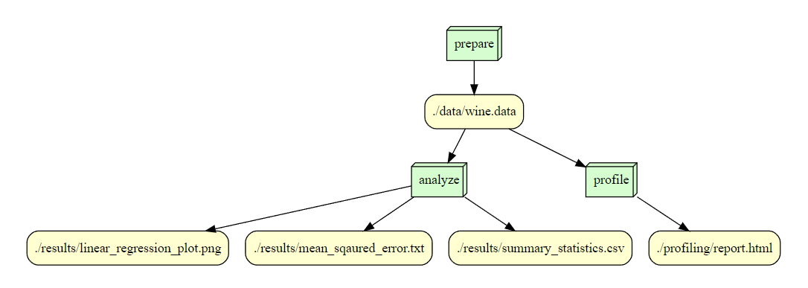

# is477-fall2023-final-project-wine

## Overview
This project focuses on the analysis of a wine dataset, specifically examining the characteristics of various wines and employing linear regression to predict the alcohol content based on their flavanoid content. The dataset, known as 'wine.data', initially lacked header information, prompting the assignment of descriptive feature names for clarity. These features, fourteen in total, include Class, Alcohol, Malic acid, among others.

An essential part of the project involved generating summary statistics for the dataset, which were saved as 'summary_statistics.csv'. This file provides a detailed overview of the dataset, including key statistical measures like mean, standard deviation, and quartiles for each feature. This step was crucial for understanding the data distribution and the specific characteristics of the wines in the dataset.

The project's main objective was to explore the relationship between flavanoid content and alcohol percentage in wines. A linear regression model was employed for this purpose. The dataset was divided into training and testing subsets to ensure a comprehensive evaluation of the model's efficacy. Post-training, the model was used to predict the alcohol content of the test set, and the mean squared error of these predictions was calculated and recorded in 'mean_squared_error.txt', providing a quantitative measure of the model's accuracy.

To visually represent the findings, a scatter plot with a linear fit was created, illustrating the actual versus predicted alcohol content based on flavanoid levels. This plot, saved as 'linear_regression_plot.png', effectively demonstrates the linear regression model's predictions in comparison to the actual data, offering a clear and informative visual summary of the model's performance in predicting alcohol content from flavanoid levels in wines.

## Analysis
The analysis conducted on the wine dataset has revealed a moderately strong relationship between flavanoid content and alcohol percentage in wines. Utilizing linear regression, the model predicts alcohol content with a mean squared error of approximately 0.5502, indicating a fair level of accuracy. The visualization, a scatter plot overlaid with a blue prediction line, clearly shows the actual data points in black and the regression line in blue, delineating the predicted alcohol content from the flavanoid levels. Despite some variance, the trend line suggests that as flavanoid content increases, there is a tendency for the alcohol content to also increase.

## Workflow

## Reproducing

1. Check the enviornment setting by observing the environment.log prior to executing the code lines.

2. Download the python packages specifically required for this project using the code below "pip install -r requirements.txt"

3. Data Preprocessing: Execute the following script for preparing the data in order to analyze: "prepare_data.py"

## License

Software License: MIT License

Data License: Creative Commons sAttribution 4.0 International (CC BY 4.0)

Dataset - Wine: Creative Commons Attribution 4.0 International (CC BY 4.0) - Original

The MIT license is a flexible and open source software license that grants permission for the use, distribution, and modification of the code for any purpose. This ensures that I as an original author receive credit for the original work. Primarily used in research and academic contexts, the MIT license is particularly useful for this project as it encourages open collaboration and innovation, allowing others to build upon and enhance this work while maintaining recognition of personal contributions.

## Reference
Citation for Wine Dataset:
Aeberhard,Stefan and Forina,M.. (1991). Wine. UCI Machine Learning Repository. https://doi.org/10.24432/C5PC7J.